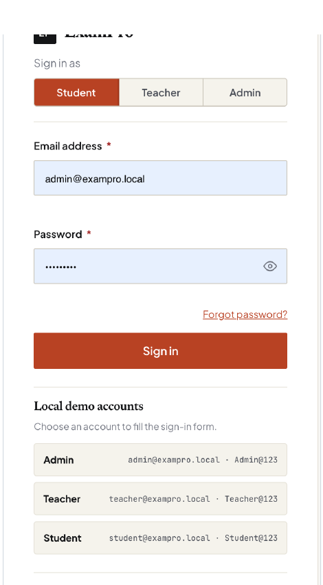
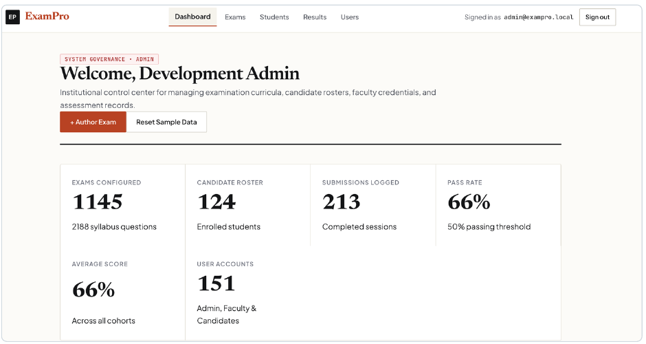
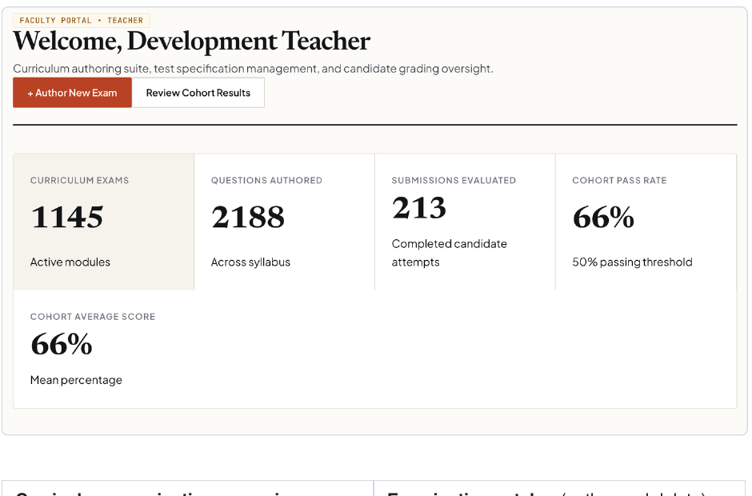
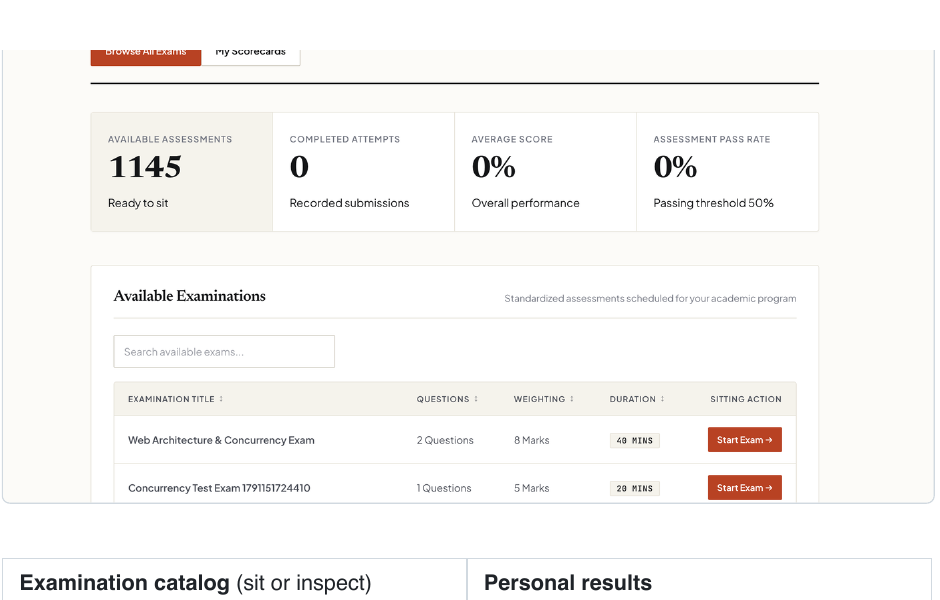
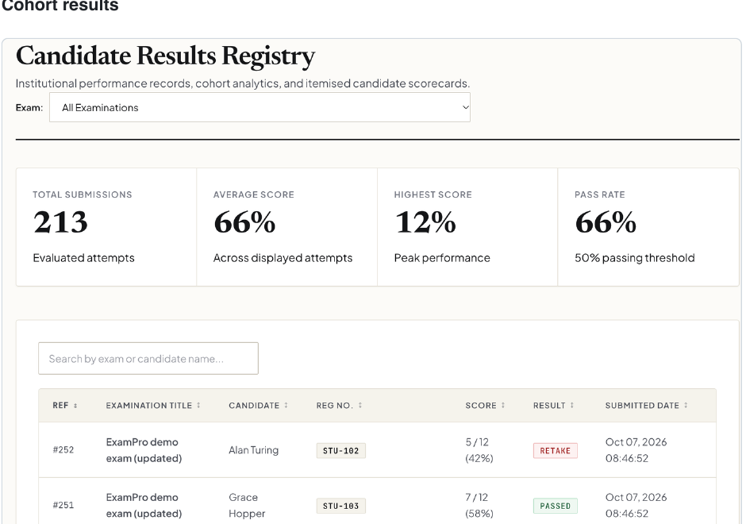

# ExamPro

## Online Examination Management System

ExamPro is a role-based academic examination platform for authoring assessments, registering candidates, delivering timed examinations, and reviewing results. It is an academic Java project built to demonstrate object-oriented programming, JDBC database access, transactions, concurrency, authentication, and browser-based integration.

> **Academic project note:** The included demonstration accounts and local database are for classroom use only. Do not use the demonstration passwords in a public deployment.

## Highlights

- Role-based workspaces for administrators, teachers, and students.
- Examination authoring for multiple-choice and true/false questions.
- Timed candidate sittings with progress tracking, keyboard navigation, and automatic submission at expiry.
- JDBC repositories with prepared statements, CRUD operations, and transaction management.
- Concurrent submission processing with a worker pool and duplicate-submission protection.
- Searchable directories, examination catalogues, results analytics, and printable scorecards.
- Responsive, accessible interface with role-aware navigation and server-enforced permissions.

## Application Screens

The following screenshots were curated from the supplied project walkthrough. They show the main user journeys and management screens.

### Sign in

The unified sign-in page supports student, teacher, and administrator access, with development-only quick-fill accounts for local testing.



### Administrator workspace

Administrators can oversee examinations, candidate records, submissions, results, and user accounts from the institutional dashboard.



### Teacher workspace

Teachers can author examinations and review cohort performance without gaining access to administrator-only account or roster controls.



### Student workspace

Students see available examinations and their own results, with a clear action to begin an assessment.



### Results registry

The results registry provides assessment filtering, search, performance summaries, and links to individual scorecards.



## Role Capabilities

| Capability | Student | Teacher | Administrator |
|---|:---:|:---:|:---:|
| Sign in and use a role-specific dashboard | Yes | Yes | Yes |
| Browse examinations | Yes | Yes | Yes |
| Take an examination | Yes | No | As configured for local demonstration |
| Review personal scorecards | Yes | No | Yes |
| View cohort results | No | Yes | Yes |
| Create and manage examinations | No | Yes | Yes |
| View answer keys | No | Yes | Yes |
| Manage students and user accounts | No | No | Yes |

## Technology and Design

| Area | Implementation |
|---|---|
| Language | Java 17 |
| Application framework | Spring Boot 3.3.4 |
| Persistence | H2 database through JDBC repositories and `PreparedStatement` |
| Security | Role-based access control, CSRF protection, server ownership checks, BCrypt password hashing |
| Browser client | Vanilla JavaScript ES modules and modular CSS |
| Build and tests | Maven, JUnit, Spring Boot Test, Spring Security Test |

## Architecture

```text
Browser SPA
  -> Web controllers and JSON APIs
  -> Services: exam catalog, sessions, submissions, cache
  -> JDBC repositories and transaction helper
  -> H2 database
```

```text
src/main/java/edu/exampro/
├── app/          Spring Boot entry point and Review 1 console demonstration
├── config/       Application startup and demo-data configuration
├── db/           Connection factory, schema setup, and transactions
├── exception/    Domain-specific exceptions
├── model/        User, exam, question, and attempt model hierarchy
├── repository/   JDBC CRUD repositories
├── security/     Authentication, roles, CSRF, and password utilities
├── service/      Examination, cache, session, and submission services
└── web/          MVC shell and REST API controllers

src/main/resources/
├── static/css/   Design tokens, layout, components, pages, and print styles
├── static/js/    Router, API client, shared UI helpers, and page modules
└── templates/    Login page, application shell, and error page

docs/screenshots/ Curated screenshots used in this README
```

## Quick Start

### Requirements

- JDK 17 or later
- Maven 3.8 or later

### 1. Run the automated tests

```bash
cd "/Users/shahmir05/Documents/JAVA PROJECT/ExamPro"
mvn clean test
```

Latest verified result: **76 tests, 0 failures, 0 errors**.

### 2. Start the web application

```bash
mvn spring-boot:run
```

Open [http://localhost:8080/login](http://localhost:8080/login).

### 3. Demonstration accounts

| Role | Email | Password |
|---|---|---|
| Administrator | `admin@exampro.local` | `Admin@123` |
| Teacher | `teacher@exampro.local` | `Teacher@123` |
| Student | `student@exampro.local` | `Student@123` |

### 4. Run the Review 1 console demonstration

```bash
mvn exec:java -Dexec.args="--console"
```

The console walkthrough demonstrates inheritance and polymorphism, JDBC CRUD, collections, generic types, transaction rollback, and concurrent submissions.

## Academic Rubric Evidence

### Java GUI / Review 1 - 33 marks

| Requirement | Marks | Evidence |
|---|---:|---|
| OOP: inheritance, polymorphism, interfaces, exceptions | 10 | `User` hierarchy, generic `Question<T>` hierarchy, repository interfaces, and custom exceptions |
| Collections and generics | 6 | `List`, `Set`, `Map`, `CrudRepository<T>`, `Question<T>`, and `InMemoryCache<T>` |
| Multithreading and synchronization | 4 | `ExecutorService`, `CompletableFuture`, `ConcurrentHashMap`, and `ReentrantLock` in `ExamSubmissionService` |
| Database model and operations | 7 | Normalized tables and matching model, repository, and service classes |
| JDBC CRUD with prepared statements | 3 | Student, examination, attempt, and account repositories use `PreparedStatement` |
| JDBC transaction management | 3 | `Transactions.run(...)` provides atomic save and rollback behavior |
| **Total** | **33** | **Implemented in the codebase and covered by tests** |

### Java Web Project - 33 marks

| Requirement | Marks | Evidence |
|---|---:|---|
| Problem understanding and solution design | 8 | Role-based workflows for assessment authoring, delivery, marking, and result review |
| Core Java concepts | 10 | Object-oriented model, interfaces, exceptions, generics, collections, and concurrency |
| Database integration (JDBC) | 8 | H2 schema, JDBC repositories, prepared statements, CRUD, and transactions |
| Web integration | 7 | Spring Boot web controllers, secure REST endpoints, server sessions, and browser application |
| **Total** | **33** | **Demonstrated by the web application and automated tests** |

## Security Summary

- Roles and ownership are enforced on the server, not only hidden in the interface.
- A student receives only their own attempts and results.
- Answer keys are not sent to a student before submission.
- State-changing browser requests use CSRF protection.
- Passwords are stored as BCrypt hashes, never as plaintext.
- Duplicate submissions are protected with per-student, per-exam locking.

## Testing

The Maven test suite includes coverage for:

- OOP hierarchy and Review 1 requirements.
- SPA shell and application routes.
- Authentication, authorization, password hashing, CSRF, and answer-key protection.
- REST endpoint access and student ownership restrictions.
- JDBC persistence, transaction handling, and concurrent submissions.

Run the suite at any time with:

```bash
mvn clean test
```

## Local Data and Backups

- Local H2 data is stored in `data/` and excluded from Git and source ZIP archives because it may contain users, results, and assessment data.
- Tables are created automatically at application startup.
- Create a fresh source archive after changes you want to preserve.
